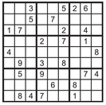
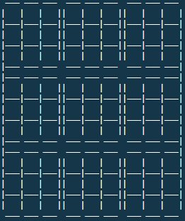

# C-in Sudoku

Command-line program in C/C++ that solves a classical Sudoku puzzle using logical constraints and backtracking

## How It Works

### Input

When running the program in the terminal, it will prompt the input of a line of 81 characters (no separators; each from 0 to 9 representing the values on a Sudoku from left to right, top to bottom; 0 indicating an empty cell).

For example, a Sudoku with the following hints is equivalent to the input `003005260005070000170002040000207010400000008090308000050900074000060800084700100`



### Data Structure

Each cell of the Sudoku is a struct that carries data including the number in the cell (0-9), whether the cell is filled, the sector number (0-8), the number of numbers that the cell can contain (avoiding repetitions in the same column, row, sector), and an array of 9 that records whether each number can be contained.

### Algorithms

The inputted Sudoku is viewed as a constraint satisfaction problem. It is known that a number (1-9) can only exist in one cell in a row, column, or sector (the squares of 9 cells) in a Sudoku. As such, once a number is inputted into a cell, the cells in its same row, column, and sector can no longer contain this same number as it'd contradict the rules and would be an invalid input. When a cell only has one number left that could be of valid input, it is inputted into the cell. The process of eliminating numbers from the cells in the same row, column, sector as the newly filled cell and filling cells with one valid input repeats until no more cells have only one valid number.

At this point, easier sudokus are solved. Harder sudokus will require the implementation of trial & error and backtracking. The program searches for an empty cell and loops through the numbers in the array of non-invalid inputs, checking after each trial to see if the Sudoku can be solved by recursively inputting non-invalid values into empty cells and eliminating invalid numbers after inputs. An error arises when a cell has 0 non-invalid inputs, which indicates there are no possible numbers the cell can contain. In this occurrence, the code backtracks to try inputting another non-invalid number in the previous cell that has tried a non-invalid input.

## Output

If a solution can be produced, it will be outputted in the terminal in the following grid:



### Sample Tests

Input 1: `000000200080007090602000500070060000000901000000020040005000603090400070006000000`

Output 1:
```
Here is the solved Sudoku puzzle
  ——— ——— ———  ——— ——— ———  ——— ——— ——— 
 | 9 | 5 | 7 || 6 | 1 | 3 || 2 | 8 | 4 | 
 |———|———|———||———|———|———||———|———|———| 
 | 4 | 8 | 3 || 2 | 5 | 7 || 1 | 9 | 6 | 
 |———|———|———||———|———|———||———|———|———| 
 | 6 | 1 | 2 || 8 | 4 | 9 || 5 | 3 | 7 | 
 |——— ——— ———  ——— ——— ———  ——— ——— ———| 
 | 1 | 7 | 8 || 3 | 6 | 4 || 9 | 5 | 2 | 
 |———|———|———||———|———|———||———|———|———| 
 | 5 | 2 | 4 || 9 | 7 | 1 || 3 | 6 | 8 | 
 |———|———|———||———|———|———||———|———|———| 
 | 3 | 6 | 9 || 5 | 2 | 8 || 7 | 4 | 1 | 
 |——— ——— ———  ——— ——— ———  ——— ——— ———| 
 | 8 | 4 | 5 || 7 | 9 | 2 || 6 | 1 | 3 | 
 |———|———|———||———|———|———||———|———|———| 
 | 2 | 9 | 1 || 4 | 3 | 6 || 8 | 7 | 5 | 
 |———|———|———||———|———|———||———|———|———| 
 | 7 | 3 | 6 || 1 | 8 | 5 || 4 | 2 | 9 | 
  ——— ——— ———  ——— ——— ———  ——— ——— ——— 
# of Hints Given: 20
```

Input 2: `000801000000000043500000000000070800000000100020030000600000075003400000000200600`

Output 2:
```
Here is the solved Sudoku puzzle
  ——— ——— ———  ——— ——— ———  ——— ——— ——— 
 | 2 | 3 | 7 || 8 | 4 | 1 || 5 | 6 | 9 | 
 |———|———|———||———|———|———||———|———|———| 
 | 1 | 8 | 6 || 7 | 9 | 5 || 2 | 4 | 3 | 
 |———|———|———||———|———|———||———|———|———| 
 | 5 | 9 | 4 || 3 | 2 | 6 || 7 | 1 | 8 | 
 |——— ——— ———  ——— ——— ———  ——— ——— ———| 
 | 3 | 1 | 5 || 6 | 7 | 4 || 8 | 9 | 2 | 
 |———|———|———||———|———|———||———|———|———| 
 | 4 | 6 | 9 || 5 | 8 | 2 || 1 | 3 | 7 | 
 |———|———|———||———|———|———||———|———|———| 
 | 7 | 2 | 8 || 1 | 3 | 9 || 4 | 5 | 6 | 
 |——— ——— ———  ——— ——— ———  ——— ——— ———| 
 | 6 | 4 | 2 || 9 | 1 | 8 || 3 | 7 | 5 | 
 |———|———|———||———|———|———||———|———|———| 
 | 8 | 5 | 3 || 4 | 6 | 7 || 9 | 2 | 1 | 
 |———|———|———||———|———|———||———|———|———| 
 | 9 | 7 | 1 || 2 | 5 | 3 || 6 | 8 | 4 | 
  ——— ——— ———  ——— ——— ———  ——— ——— ——— 
# of Hints Given: 17
```
